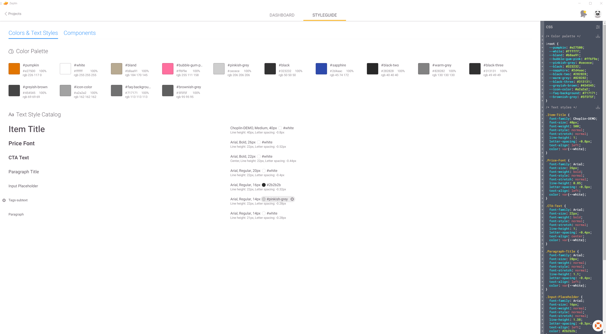

# Tools

## UX

### Handoff tools

#### Brandy
https://getbrandy.io/
Is  a little desktop panel to save colors, a logo and fonts for your style guide.

For me it wasn't comprehensive enough to use. Difficult to share and use with a team.

#### Zeplin
https://zeplin.io/ 
Converts your PSD / Sketch / Figma files into CSS. It saves a style guide with all colors, fonts and sizes.

It can even detect buttons and save the sizes and colors based on the name in the PSD file.

If you're using sketch you can also import components.

##### Pricing
Free for 1 project. 17$ / mo for 3. Quite expensive

### Invision App
The freehand drwing is cool, easily sketch some shapes.

Prototyping can be uploaded from sketch and exported to CSS.

## User Flows

### Overflow.io
XD in the browser. Currently only for MacOS.

## Experience Monitoring Tools

### Fullstory
https://www.fullstory.com/

### Hotjar

### 
